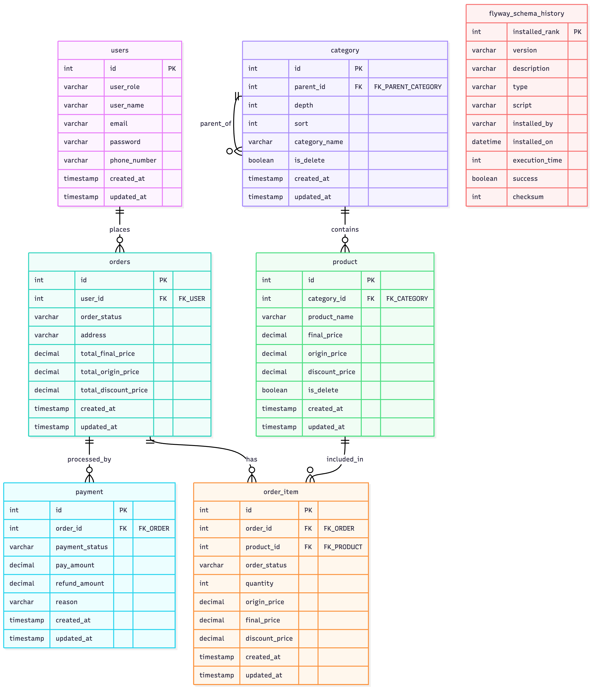

# E-commerce 모놀리식 백엔드 프로젝트

## 📋 프로젝트 개요
* 대용량 트래픽을 고려한 모놀리식 E-commerce 백엔드 서버
* 목표: 초당 100건 이상의 요청 처리가 가능한 시스템 구현
* 결과: 초당 TPS 약 83 달성 (목표 대비 83% 달성)

---

## 🛠 기술 스택
* **언어**: Java 21
* **프레임워크**: Spring Boot 3.5.0
* **웹 서버**: Undertow
* **API 문서**: Swagger
* **데이터베이스**: MySQL 8.0, Spring Data JPA, Flyway
* **가상화**: Docker Compose
* **CI/CD**: Jenkins
* **캐시**: Redis 8.2
* **메트릭 모니터링**: Prometheus, Grafana
* **로그 모니터링**: ELK Stack (Elasticsearch, Logstash, Kibana)
* **테스트**: Spring Boot TestContainers, Mockito, JMeter


---

## 📦 도메인 및 주요 기능

### 주문 도메인
**주문 등록 플로우**
```
1. 상품 재고 확인
2. 주문 생성
3. 재고 차감
4. 주문 확정 (환불 가능 기간 만료 등으로 취소 불가능한 상태)
** 주문시 상품, 주문상태에 대한 동시성 이슈 방지를 위해 비관적 락 적z
```

**주문 취소**
- 전체 취소 / 부분 취소 지원
- 재고 복구 처리 (원자성 보장)

**동시 주문 처리**
- 비관적 락을 통한 재고 정합성 보장

### 상품 도메인
**상품 조회**
- 적용 필터링 (카테고리, 가격대), 가격 기준 정렬 선택 
- 페이징 및 정렬 지원
- 캐싱을 통한 조회 성능 최적화

**리더보드**
- 실시간 인기 상품 랭킹
- 주문 발생 시 자동 점수 갱신

### 유저 및 카테고리
- CRUD 및 연관 데이터 조회
- 캐싱을 통한 조회 성능 최적화

---

## 📊 ERD
<details>
<summary><b>🗂 클릭으로 보기 데이터베이스 ERD 다이어그램 보기</b></summary>

<br>

<p>
  
</p>

</details>

---

## 🧪 테스트

### API 테스트
**통합 테스트**
- TestContainers로 실제 MySQL, Redis 환경 구축
- 실제 DB 트랜잭션 및 캐싱 동작 검증
- 동시성 테스트: 100명이 재고 1개 상품 동시 주문 시나리오

### 성능 테스트
**도구**: Apache JMeter

**테스트 시나리오 (순서대로 실행)**
1. 카테고리 조회
2. 상품 목록 조회
3. 상품 상세 조회
4. 주문 등록
5. 주문 확정

**성능 목표**

| 지표 | 목표치 | 설명 |
|------|--------|------|
| 초당 처리량 (TPS) | 100 | Transactions Per Second |
| Latency | 5초 이하 | 응답 시간 |
| 에러율 | 0.1% 이하 | 실패율 |
| CPU 사용률 | 50% 이하 | 서버 부하 |

---

## 📈 성능 테스트 결과

### 테스트 환경
- **환경**: 로컬 개발 환경 (Docker Compose)
- **Thread 수**: 3000
- **조건**: 락 적용 후 측정

### 결과 요약
<details>
<summary><b>📊 클릭으로 성능 테스트 결과 상세 보기</b></summary>

<br>

<p>
  
</p>

</details>

| 지표 | 목표 | 결과 | 달성률                 |
|------|------|------|---------------------|
| TPS | 100 | 83 | 83%                 |
| Latency | 5초 이하 | 최대 6초 | Thread 3000 초반까지 유지 |
| 에러율 | 0.1% 이하 | 0% | 달성                  |
| CPU 사용률 | 50% 이하 | 20% | 달성                  |

### 상세 분석
**TPS 83 달성**
- 목표 대비 83% 달성
- 비관적 락으로 인한 처리량 감소
- 로컬 환경 특성상 네트워크 비용 없음

**Latency 증가 구간**
- Thread 3000까지: 5초 이하 유지
- Thread 3000 초과: 최대 6초까지 증가
- 병목 지점: DB 커넥션 풀 및 락 대기 시간

**에러율 0%**
- 타임아웃 미설정 환경
- 재고 정합성 100% 유지 (오버셀 0건)

**CPU 사용률 20%**
- 예상보다 낮은 CPU 사용률
- 병목이 CPU가 아닌 I/O(DB)에서 발생

### 병목 지점 분석
1. **DB 레벨 병목**
    - 비관적 락 대기 시간 증가
    - 커넥션 풀 부족 (최대 20개)
    - 단일 DB 인스턴스의 처리 한계

2. **락 경합**
    - 동일 상품에 대한 동시 주문 시 직렬화
    - 락 대기 큐 증가로 인한 Latency 증가

---

## 🚀 추후 개선 사항

### 1. 응답 시간 개선
**문제점**
- Thread 3000 이상에서 Latency 6초까지 증가
- DB 레벨 병목 현상 확인

**개선 방안**
- **API 비동기 처리**: Spring WebFlux 도입 또는 Kafka 기반 이벤트 드리븐 아키텍처
- **DB 인덱스 재검토**: 슬로우 쿼리 분석 및 최적화
- **DB 클러스터링**: Master-Replica 구조로 읽기 부하 분산
- **캐싱 확대**: 조회 API 캐싱 비율 증대

### 2. 처리량 향상
- **커넥션 풀 확대**: 부하 테스트 기반 적정 크기 산정
- **낙관적 락 검토**: 충돌이 적은 API에는 낙관적 락 적용
- **Redis 분산 락**: 멀티 인스턴스 환경 대비

### 3. 확장성 개선
- **수평 확장**: 로드 밸런서 + 멀티 인스턴스 구성
- **데이터베이스 샤딩**: 상품 ID 기반 샤딩 전략
- **MSA 전환**: 도메인별 독립적 확장

---

## 🏃 애플리케이션 실행 방법

### 사전 요구사항
- Java 21 설치
- Docker, Docker Compose 설치

### 실행 순서
1. **Docker Compose 실행**
   ```bash
   docker-compose up -d
   ```

2. **더미 데이터 삽입**
   ```bash
   /e-commerce-monolithic/src/main/resources/db/dummyData 경로의 SQL 파일 실행
   ```

3. **애플리케이션 실행**
   ```bash
   ./gradlew bootRun
   ```

### 접속 정보
- **Swagger UI**: http://localhost:8080/swagger-ui.html
- **Grafana 대시보드**: http://localhost:3000
    - ID: admin / PW: admin
- **Kibana**: http://localhost:5601

---
